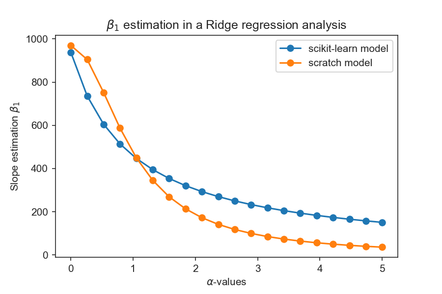

# understanding-ML-techniques
The purpose of this repository is to practice and understand machine learning techiques. The goal is to reproduce models found in scikit-learn and provide an overall explanation behind the techniques and the jargon used in the ML field. I will be adding plots comparing my results and scikit-learns with additional information to be found in my linked jupyter notebooks.

### Linear Models
[Ridge regression notebook](./linear_models/ridge_regularization.ipynb)

